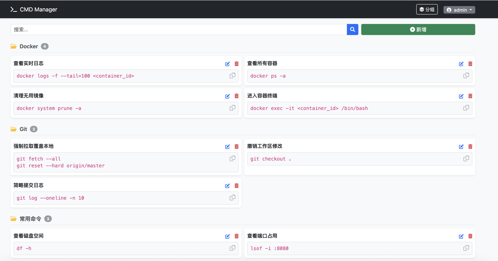
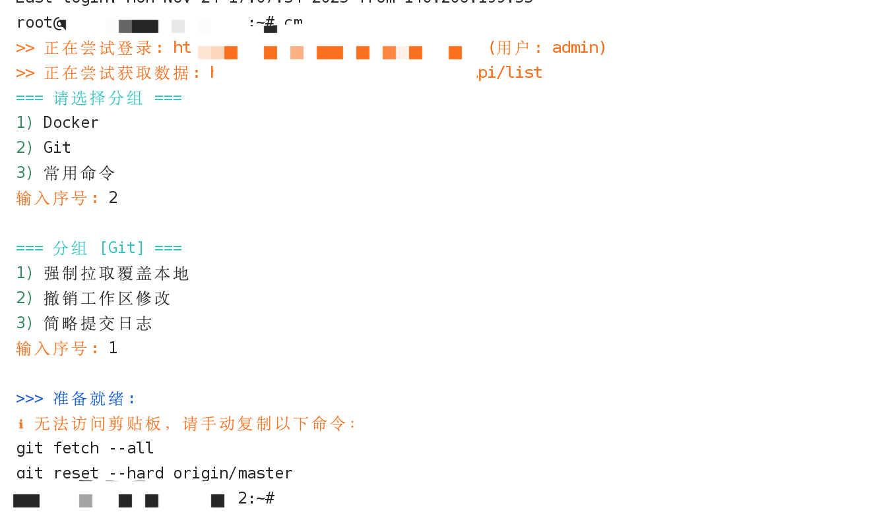

管理界面进行命令的管理，小鸡读取管理的命令，并输出
#### 2\. 管理界面安装

```bash
# 先创建一个存放数据的文件夹
mkdir -p cmd_data

# 简单运行 用户默认admin 密码默认123456，进入界面后请尽快修改密码
docker run -d \
  --name my-cmd \
  --restart always \
  -p 5000:5000 \
  -v $(pwd)/cmd_data:/app/data \
  ghcr.io/assast/cmd_manager:latest
  
# 或者完整的运行
docker run -d \
  --name my-cmd \
  --restart always \
  -p 5000:5000 \
  -v $(pwd)/cmd_data:/app/data \
  -e ADMIN_USER="admin" \
  -e ADMIN_PASSWORD="你的强密码" \
  -e SECRET_KEY="随机生成的复杂字符串" \
  ghcr.io/assast/cmd_manager:latest
```

**参数解释：**

  * `-v $(pwd)/cmd_data:/app/data`:  **最关键的一步**。它把容器里的 `/app/data` 映射到你电脑上的 `cmd_data` 文件夹。这样即使你删除了容器，你的 `database.db` 依然保存在你的电脑里，不会丢失。
  * `-e ADMIN_PASSWORD="..."`: 设置管理员密码。不填默认123456
  * `-e SECRET_KEY="..."`: 设置防伪密钥，保证 Cookie 安全。不填会默认一个固定值01KATX9WSFP1T9C4JK26C29AQB，建议自己设置一个

**小鸡一键脚本**
```
curl -fsSL https://raw.githubusercontent.com/assast/cmd_manager/refs/heads/main/install.sh -o cm_install.sh && chmod +x cm_install.sh && ./cm_install.sh admin 123456 http://127.0.0.1:5000
```
如果密码有特殊字符 比如有&、=等，请用 ""包裹密码。样例为
```
curl -fsSL https://raw.githubusercontent.com/assast/cmd_manager/refs/heads/main/install.sh -o cm_install.sh && chmod +x cm_install.sh && ./cm_install.sh admin "12345=6" http://127.0.0.1:5000
```
**界面示例：**

